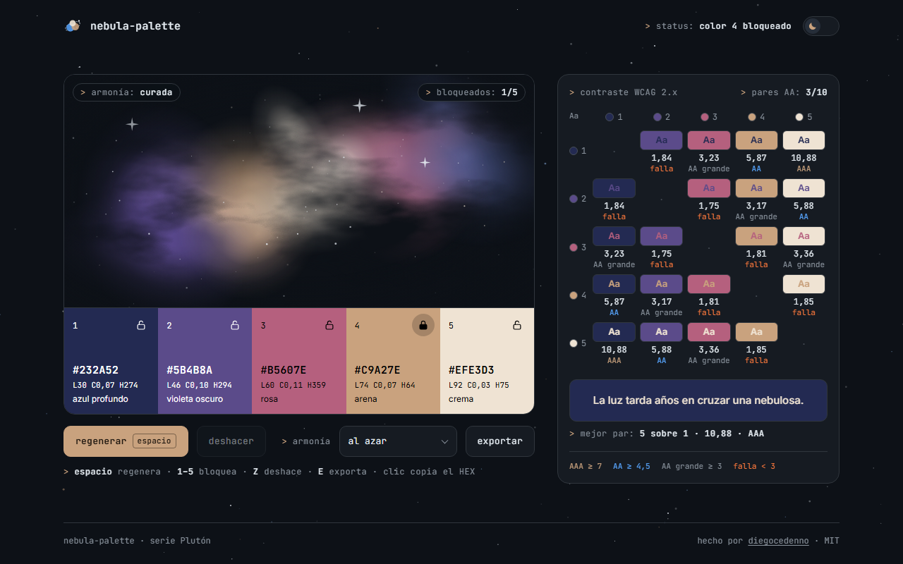

# nebula-palette

> A color palette generator that paints every palette as a drifting nebula. Lock colors, regenerate with the space bar, export as CSS variables or JSON, and check the contrast of every pair.
>
> Un generador de paletas de color que pinta cada paleta como una nebulosa a la deriva. Bloquea colores, regenera con la barra espaciadora, exporta como variables CSS o JSON y verifica el contraste de cada par.

**[Live demo · Demo en vivo →](https://diegocedenno.github.io/nebula-palette/)**

**[English](#english)** · **[Español](#español)**

---

## English

### What it does

- Generates five-color palettes from a harmony scheme — analogous, complementary, triad, split complementary or monochromatic — picked at random or chosen by you.
- Paints the palette as a nebula: one cloud of gas per color, slowly drifting under a layer of dust and stars. A new palette cross-fades in.
- Lock any color and the next palette is built around it: the locked color keeps its role in the scheme and its step on the lightness ramp.
- Shows HEX and OKLCH for each swatch, with ink that is always readable on top of it. Click a swatch to copy its HEX.
- Checks all pairs against WCAG 2.x: a 5×5 matrix (a list on phones) with the ratio, the level — AAA, AA, AA large, fail — and a live "Aa" sample.
- Exports `:root { --nebula-1: … }` or JSON, to the clipboard or as a file.
- Undo steps back through the last 20 palettes. The palette, locks and scheme survive a reload, and the palette lives in the URL hash (`#232a52-5b4b8a-…`) so a link shares it.
- A switch in the header flips between dark and light mode: the same sky redrawn as a star chart on paper, where the nebula turns from glowing gas into watercolor pigment. The choice is remembered and shared across the Plutón series.

### What makes it technically interesting

- **Palettes are built in OKLCH, not RGB.** Hue comes from the scheme, lightness from a dark-to-light ramp (so there are always readable pairs), and chroma from one "vividness" value shaped to fade toward black and white. Out-of-gamut colors are mapped back to sRGB by reducing chroma with a binary search, which keeps hue and lightness intact instead of clipping channels.
- **The gas never repaints.** Each color is its own SVG layer of radial-gradient blobs blended with `screen` (`multiply` on paper; each layer carries both tints as CSS variables, so switching theme repaints nothing in JavaScript). The blobs are static; the whole layer drifts with a CSS animation on `transform`, so the compositor does the work. The dust is fractal noise (`feTurbulence`) rasterized once as a mask image on a static layer — no filter is evaluated per frame.
- **Deterministic art.** The layout of the cloud is seeded with a hash of the palette, so the same five colors always paint the same nebula.
- **Honest contrast numbers.** Relative luminance and ratios follow WCAG 2.x, and ratios are truncated rather than rounded: 4.499 never shows up as a passing "4,50". Swatch ink is black or white, whichever wins — the worst case is √21 ≈ 4.58:1, always above AA.
- **The space bar is not hijacked.** After a mouse or touch click the control drops focus so space keeps regenerating; when you navigate with Tab, space activates the focused control as usual.
- **Copy never fails loudly.** `navigator.clipboard` falls back to a temporary textarea, and if that fails too the code is selected for you. Nothing reaches the console.
- **Reduced motion is a first-class path.** With `prefers-reduced-motion` the clouds stay still, stars do not twinkle and palettes change with a short opacity fade.
- **Zero dependencies, zero build.** Plain HTML, CSS and JavaScript. Fonts are bundled; nothing is requested from the network.

### Keyboard

| Key | Action |
| --- | --- |
| `Space` | Regenerate the unlocked colors |
| `1`–`5` | Lock / unlock a color |
| `Z` | Undo |
| `E` | Open the export panel |
| `←` `→` | Switch between CSS and JSON inside the panel |
| `Esc` | Close the panel |

### Run it

Double-click `index.html`. That is all — there is no build step and no server.
It also works as-is on GitHub Pages.

### License

[MIT](LICENSE) © Diego Cedeño. Inter and JetBrains Mono are bundled under the [SIL Open Font License](assets/fonts/).

---

## Español

### Qué hace

- Genera paletas de cinco colores a partir de un esquema de armonía —análogo, complementario, tríada, complementario dividido o monocromático— elegido al azar o por ti.
- Pinta la paleta como una nebulosa: una nube de gas por color, que deriva despacio bajo una capa de polvo y estrellas. La paleta nueva entra con un fundido cruzado.
- Bloquea cualquier color y la siguiente paleta se construye a su alrededor: el color bloqueado conserva su papel en el esquema y su peldaño en la rampa de claridad.
- Muestra el HEX y el OKLCH de cada muestra, con una tinta siempre legible encima. Haz clic en una muestra para copiar su HEX.
- Verifica todos los pares con WCAG 2.x: una matriz 5×5 (una lista en el móvil) con la razón, el nivel —AAA, AA, AA grande, falla— y una muestra «Aa» en vivo.
- Exporta `:root { --nebula-1: … }` o JSON, al portapapeles o como archivo.
- Deshacer recorre las últimas 20 paletas. La paleta, los bloqueos y el esquema sobreviven a una recarga, y la paleta viaja en el hash de la URL (`#232a52-5b4b8a-…`): un enlace basta para compartirla.
- Un interruptor en la cabecera alterna entre modo oscuro y claro: el mismo cielo redibujado como carta estelar sobre papel, donde la nebulosa pasa de gas luminoso a pigmento de acuarela. La elección se recuerda y se comparte entre los proyectos de la serie Plutón.

### Qué lo hace interesante técnicamente

- **Las paletas se construyen en OKLCH, no en RGB.** El tono lo dicta el esquema, la claridad sale de una rampa de oscuro a claro (así siempre hay pares legibles) y el croma de una única «viveza» que se atenúa hacia el negro y el blanco. Los colores fuera de gama vuelven a sRGB reduciendo el croma con una búsqueda binaria, que conserva tono y claridad en lugar de recortar canales.
- **El gas no se repinta nunca.** Cada color es su propia capa SVG de manchas con degradado radial, mezcladas en modo `screen` (`multiply` sobre papel; cada capa lleva sus dos tintes como variables CSS, así que cambiar de tema no repinta nada desde JavaScript). Las manchas son estáticas; lo que deriva es la capa entera, con una animación CSS de `transform`, así que el trabajo lo hace el compositor. El polvo es ruido fractal (`feTurbulence`) rasterizado una sola vez como máscara de una capa estática: ningún filtro se evalúa por frame.
- **Arte determinista.** La forma de la nube se siembra con un hash de la paleta: los mismos cinco colores pintan siempre la misma nebulosa.
- **Números de contraste honestos.** La luminancia relativa y las razones siguen WCAG 2.x, y las razones se truncan en vez de redondearse: un 4,499 nunca aparece como un «4,50» que aprueba. La tinta de cada muestra es negro o blanco, el que gane; el peor caso es √21 ≈ 4,58:1, siempre por encima de AA.
- **La barra espaciadora no queda secuestrada.** Tras un clic de ratón o de dedo el control suelta el foco y espacio sigue regenerando; si navegas con Tab, espacio activa el control enfocado, como siempre.
- **Copiar nunca falla con ruido.** `navigator.clipboard` recurre a un textarea temporal y, si eso también falla, el código queda seleccionado. Nada llega a la consola.
- **El movimiento reducido es un camino de primera clase.** Con `prefers-reduced-motion` las nubes quedan quietas, las estrellas no titilan y las paletas cambian con un fundido corto de opacidad.
- **Cero dependencias, cero build.** HTML, CSS y JavaScript sin más. Las fuentes van incluidas; no se pide nada a la red.

### Teclado

| Tecla | Acción |
| --- | --- |
| `Espacio` | Regenerar los colores no bloqueados |
| `1`–`5` | Bloquear / liberar un color |
| `Z` | Deshacer |
| `E` | Abrir el panel de exportación |
| `←` `→` | Cambiar entre CSS y JSON dentro del panel |
| `Esc` | Cerrar el panel |

### Cómo correrlo

Doble clic en `index.html`. Nada más: no hay build ni servidor.
También funciona tal cual en GitHub Pages.

### Licencia

[MIT](LICENSE) © Diego Cedeño. Inter y JetBrains Mono se incluyen bajo la [SIL Open Font License](assets/fonts/).
